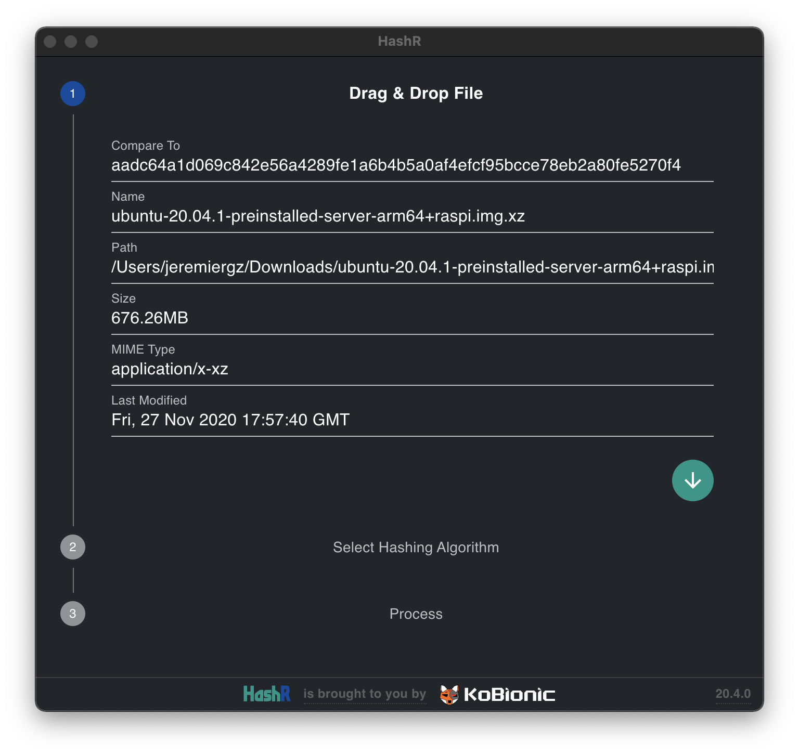
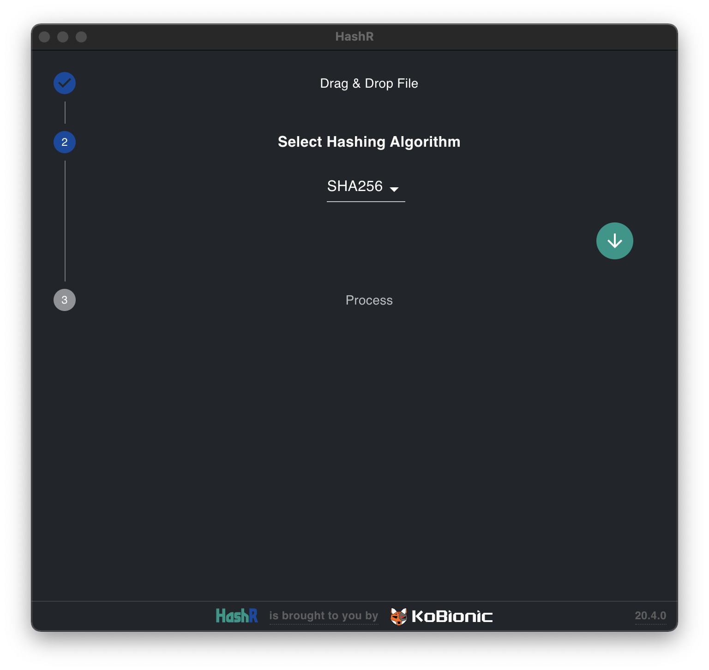
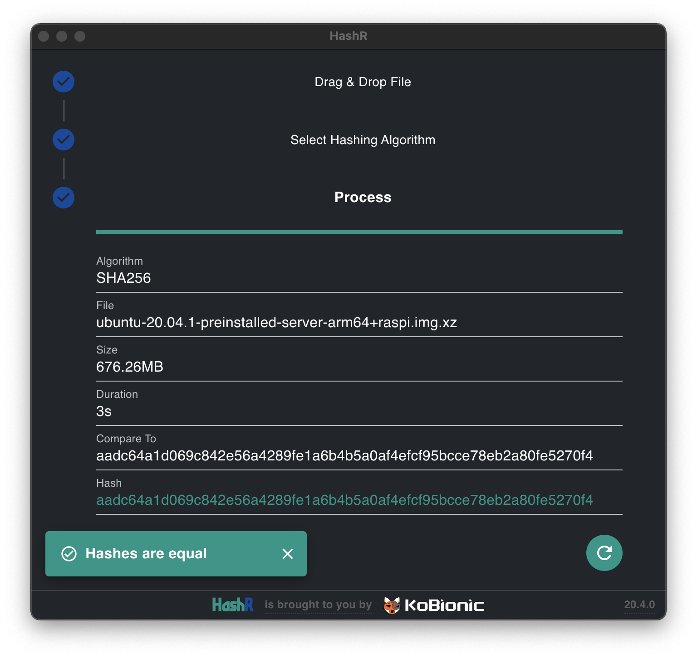

---

An easy to use file hashing utility working with multiple algorithms. Powered by [React](https://reactjs.org/) & [Material UI](https://material-ui.com/), built as a cross-plaform desktop application using [Electron](https://www.electronjs.org/).

---

## Usage

After starting the application, **drag & drop** your target file to window's central area. File information will automatically be filled up.

The `Compare To` field is _optional_. However, you might want to fill it up to have a **comparison** made between this field an the digest generated from given file.

Then, click on the _arrow down button_ to go to the **hashing algorithm selection step** where you can select between algorithms available on your platform.

Click again on the _arrow down button_ to go to the **process screen**. Upon completion, generated digest will appear in the `Hash` field.

A comparison will be done only if a string was entered in the `Compare To` field during first step.

Finally, clicking again on the button will get you back to first step.

## Authors

- [**Jeremie Rodriguez**](https://github.com/jeremiergz) &lt;[jeremie.rodriguez@kobionic.com](mailto:jeremie.rodriguez@kobionic.com)&gt; - Main developer

## License

This project is licensed under the Apache License 2.0 - see the [LICENSE](<[LICENSE](https://github.com/KoBionic/hashr/blob/main/LICENSE)>) file for details.

---

[

](https://github.com/KoBionic/)
